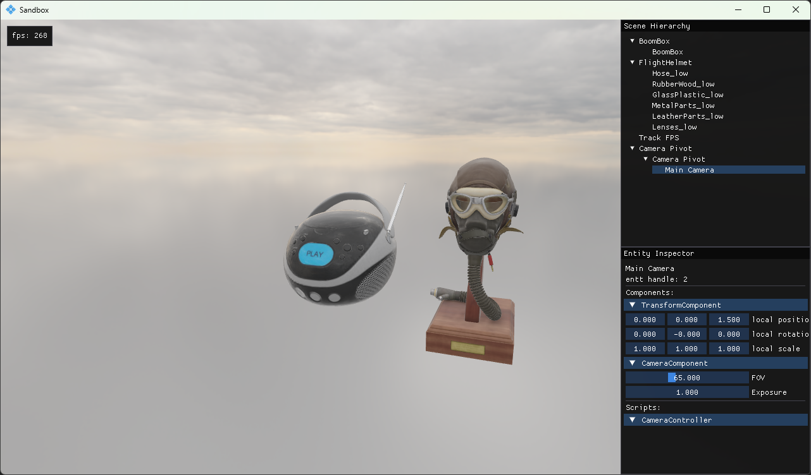

# GE Engine



## Live Demo

[//]: # (Here is a [GitHub Page]&#40;https://todo&#41; with a live demo)

TODO: put link here

## Overview

GE Engine (GE stands for Game Engine) is a simple game engine primarily designed to make it easy to experiment with
WebGPU, and eventually Vulkan.

It can build for the web using emscripten, and natively using [Dawn](https://dawn.googlesource.com/dawn)

GE Engine does not have an editor. Instead, there is a separate engine library, and engine tools executables. For
example, the PackageAssets tool should be run before every build, and it will package any assets that have not already
been packaged.

This repository includes a .run folder with CLion run configurations that will handle all of this automatically. If you
do not use CLion, you will have to set up a build script that uses the PackageAssets tools, or manually use
PackageAssets whenever you change or add any assets.

## Build Instructions

TODO: update build instructions

- **Windows**
    - Terminal
        - [Native](#building-windows-native-in-terminal)
        - [WASM](#building-wasm-on-windows-in-terminal)
    - CLion
        - [Native](#building-windows-native-in-clion)
        - [WASM](#building-wasm-on-windows-in-clion)

### Building windows native in terminal

```
git clone https://github.com/CallumFerguson/GameEngine
cd GameEngine
git submodule update --init
```

- Open Visual Studio
- On the menu bar, select Tools > Command Line > Developer Command Prompt or Developer PowerShell.
- cd into GameEngine

```
cmake -B build -G Ninja
cmake --build build --target Sandbox
cd build/dist
.\GameEngine.exe
```

### Building WASM on windows in terminal

```
git clone https://github.com/CallumFerguson/GameEngine
cd GameEngine
emcmake cmake -B build-wasm -G Ninja -DEMSDK_PATH=C:\path\to\emsdk
cmake --build build-wasm --target Sandbox
cd build-wasm/dist
```

Then host local server to view the build. For example:

```
http-server -p 8080
```

### Building Windows native in CLion

```
git clone https://github.com/CallumFerguson/GameEngine
cd GameEngine
git submodule update --init
```

- Open project in CLion
- Select Visual Studio for the CMake Toolchain
- Select the Sandbox run configuration
- Press build or run

### Building WASM on windows in CLion

```
git clone https://github.com/CallumFerguson/GameEngine
```

- Open project in CLion
- create a .env file and add emscripten_cmake_path=C:\Program Files\JetBrains\CLion [version]
  \bin\cmake\win\x64\bin\cmake.exe
- Go to "File" > "Settings", then "Build, Execution, Deployment" > "Toolchains"
- Add a new System toolchain and name it "Emscripten"
- Set CMake to the included cmake-emscripten.bat
- go to "Build, Execution, Deployment" > "CMake"
- Duplicate "Debug" and name it "Debug-Emscripten"
- Select "Emscripten" for "Toolchain"
- Add -DEMSDK_PATH=C:\path\to\emsdk to CMake Options
- Close settings and select the Sandbox-Emscripten | Debug-Emscripten run configuration
- Go to "Run" > "Edit Configurations..."
- Select "CMake Application" > "Sandbox-Emscripten"
- Set Executable to the included start-http-server.bat
- cd into browser-reloader and run "npm install"
- Press run and go to http://127.0.0.1:3002
